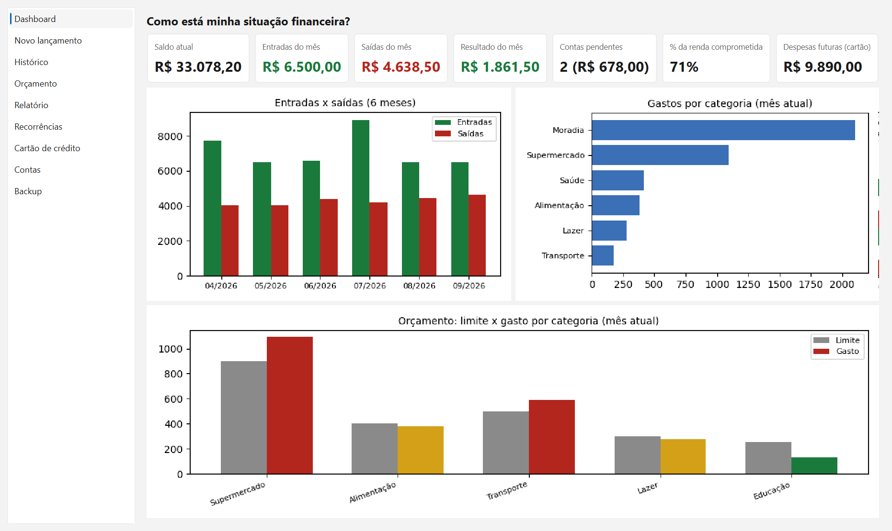
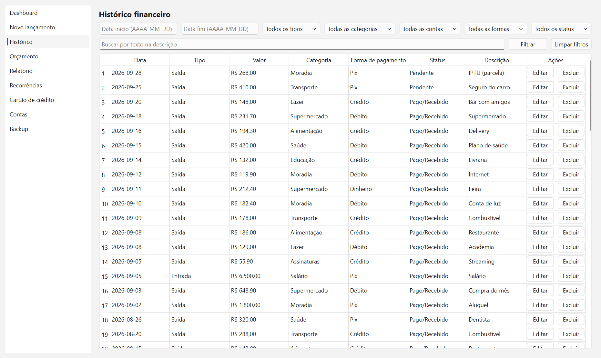
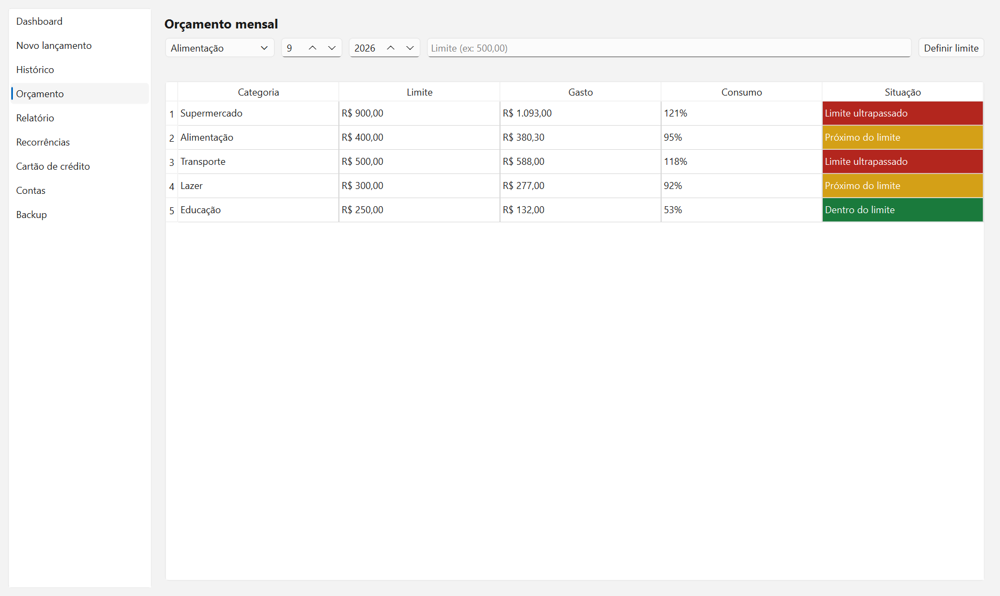
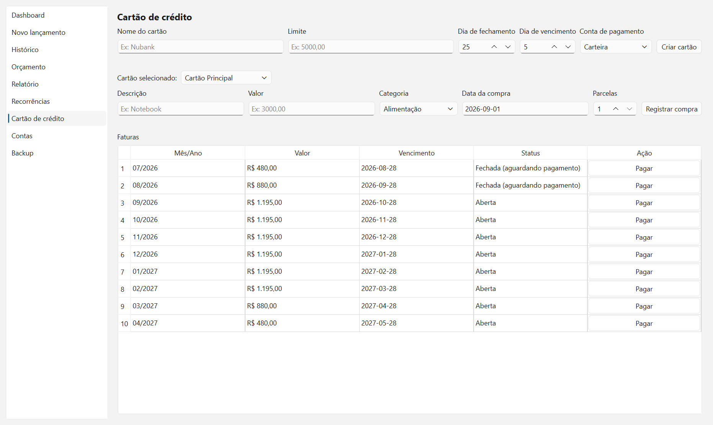
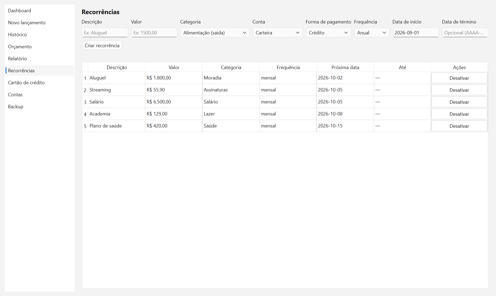
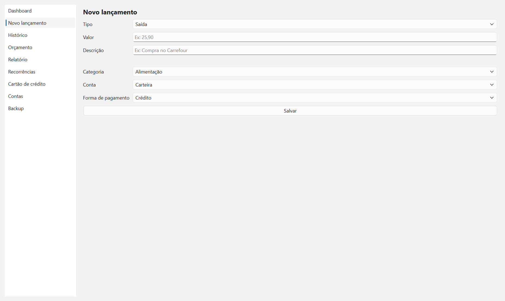

# Controle Financeiro

Aplicação desktop em Python para controle financeiro pessoal. Ver
[projeto_controle_financeiro_python.md](projeto_controle_financeiro_python.md)
para a especificação completa.

## Telas

> As imagens abaixo usam um perfil de demonstração com dados fictícios.

### Dashboard

Indicadores do mês, entradas x saídas dos últimos 6 meses, gastos por categoria
e consumo do orçamento (verde dentro do limite, amarelo próximo, vermelho estourado).



### Histórico

Filtros por período, tipo, categoria, conta, forma de pagamento e status, busca
por texto, e edição/exclusão de cada lançamento.



### Orçamento

Limite por categoria, comparação com o realizado e a situação de cada uma.



### Cartão de crédito

Compras parceladas distribuídas nas faturas seguintes, com fechamento e
vencimento próprios, e projeção dos meses futuros.



### Recorrências

Despesas e receitas fixas, com a próxima data de geração. Ao abrir o app, os
lançamentos vencidos são criados automaticamente com status pendente.



### Lançamento rápido



## Uso

```bash
pip install -r requirements.txt
python main.py       # abre a interface gráfica (PySide6)
python main.py --cli # interface de linha de comando (alternativa)
pytest                # roda os testes
```

## Perfis

O app abre com uma tela de login. Cada perfil (ex: "Ana", "João") tem
senha própria e um banco SQLite totalmente separado dos demais —
`data/perfis/<nome>.db`. O cadastro de perfis fica num banco à parte,
`data/perfis.db` (nome, hash da senha com salt via PBKDF2, nunca a senha
em si). Ao criar o **primeiro** perfil, se já existir o banco antigo
(`data/controle_financeiro.db`, de antes dessa funcionalidade existir),
ele é copiado automaticamente para virar os dados desse perfil — o
arquivo antigo não é apagado, fica como estava.

## Gerar o executável e o instalador

```bash
pip install pyinstaller
pyinstaller ControleFinanceiro.spec       # gera dist\ControleFinanceiro.exe (~80 MB, arquivo único)
```

O `.exe` gerado não precisa de Python instalado na máquina de destino.
Ele cria sua própria pasta `data/` (bancos de dados) e `reports/` (PDFs)
ao lado de onde estiver — pode ser copiado e rodado de qualquer lugar.

Para gerar um instalador de verdade (atalhos no Menu Iniciar e Desktop,
desinstalador):

```bash
pyinstaller ControleFinanceiro.spec
# instale o Inno Setup (https://jrsoftware.org/isinfo.php), depois:
iscc installer\ControleFinanceiro.iss
```

O instalador final fica em `installer\output\ControleFinanceiro_Setup.exe`.
Instala por usuário (sem precisar de admin), porque o app grava seus
próprios dados dentro da pasta de instalação.

## Estrutura

- `app/database` — conexão, schema e seed do SQLite (dados financeiros) e do registro de perfis
- `app/models` — dataclasses das entidades
- `app/repositories` — acesso e persistência dos dados
- `app/services` — regras de negócio (validação, sugestão de categoria, orçamento, perfis)
- `app/analytics` — indicadores do dashboard, consumo de orçamento, insights e relatório mensal
- `app/reports` — geração do relatório mensal em PDF
- `app/interface/cli.py` — interface de linha de comando
- `app/interface/gui` — interface gráfica em PySide6 (login, dashboard, lançamento, histórico, orçamento, relatório, recorrências, cartão de crédito, contas)
- `tools/gerar_screenshots.py` — cria um banco de demonstração com dados fictícios e regera as imagens do README

## Status

Fase 1 (planejamento), Fase 2 (banco de dados), Fase 3 (cadastro), Fase 4
(consultas: histórico com filtros), Fase 5 (orçamento), Fase 6 (dashboard
gráfico em PySide6), Fase 7 (relatório mensal em PDF, com insights por
regras determinísticas), Fase 8 (despesas e receitas recorrentes, com
geração automática de lançamentos pendentes ao abrir o app) e Fase 9
(cartão de crédito: compras parceladas, faturas por fechamento/vencimento,
pagamento gerando movimentação, projeção de despesas futuras) concluídas.

Também foram adicionadas, além do roadmap original: uma tela de cadastro
de contas (banco, poupança, carteira digital etc.), que já existia como
serviço desde a Fase 3 mas não tinha interface própria; edição/exclusão
de movimentações no Histórico (GUI) e via novas opções na CLI, incluindo
a confirmação antes de excluir pedida na seção 6 do documento; login com
múltiplos perfis, cada um com seu próprio banco de dados isolado (o
documento original listava "múltiplos usuários" como fora do escopo do
MVP — essa é uma extensão pedida depois que o núcleo já estava pronto);
e backup (seção 20 — estava na lista do MVP 1.0 mas nunca tinha sido
implementado): backup manual e automático (uma vez por dia, ao abrir o
app), restauração e exportação de movimentações em CSV, em `app/services/backup_service.py`
e na aba "Backup" da GUI / opções 18–21 da CLI.

Fase 10 (empacotamento e instalador) concluída: `ControleFinanceiro.spec`
gera um `.exe` único via PyInstaller (testado — abre, cria perfil, mostra
o dashboard com os gráficos e não precisa de Python instalado), e
`installer/ControleFinanceiro.iss` é o script do Inno Setup que gera o
instalador com atalhos e desinstalador (compilado com o Inno
Setup 7.1 — resulta em `ControleFinanceiro_Setup.exe`, ~73 MB).
"Atualização" automática, também listada na Fase 10, ficou de fora:
exigiria um servidor de releases, fora do escopo de um app local.

Roadmap original completo (Fases 1–10) e as extensões pedidas depois.

## Licença

MIT — ver [LICENSE](LICENSE).
